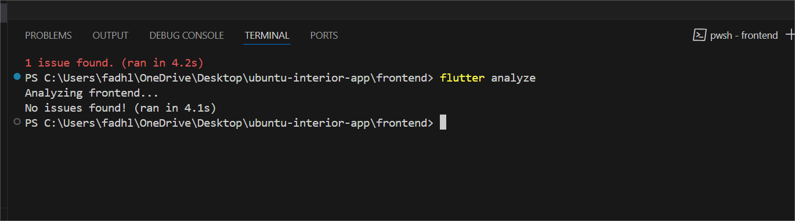
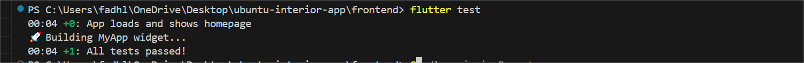

# 🌟 Ubuntu Interiors

A multi-role mobile app built with Flutter for browsing and purchasing unique artworks. Customers can explore categories, add to cart, and securely pay using Flutterwave. Artists can upload artworks and manage their listings and orders.

---

## 🚀 Features

### 👥 Authentication
- Firebase Authentication
- Role-based login and signup (Customer / Artist)

### 🎨 Customer Features
- Browse artworks by category or artist
- View artwork details
- Add/remove items from Firestore-backed cart
- Real-time cart subtotal calculation
- Multi-step checkout with address and payment
- Flutterwave payment integration (multi-currency)
- Order summary and order history with receipts

### 👩‍🎨 Artist Features
- Upload artworks with image and metadata
- Manage listed artworks
- View orders containing their artworks
- Update order status per item (e.g., "Processing", "Shipped")

---

## 🛠️ Tech Stack

| Layer          | Technology                             |
|----------------|-----------------------------------------|
| Frontend       | Flutter (Dart)                          |
| Backend        | Firebase (Auth, Firestore, Storage)     |
| Payment        | Flutterwave (Test mode)                 |
| State Mgmt     | setState (Simple), Provider for scaling |
| Architecture   | Clean and modular architecture          |
| Media Storage  | Firebase Storage                        |
| Auth & Users   | Firebase Authentication                 |
| Testing        | `flutter_test`, widget tests            |

---

## 📁 Project Structure

```
lib/
│
├── screens/             # UI pages for customers and artists
│   ├── customer/
│   ├── artist/
│
├── services/            # Firebase and business logic
│   ├── auth_service.dart
│   ├── cart_service.dart
│   ├── payment_service.dart
│
├── models/              # Reusable model classes (e.g., Artwork, Order)
├── widgets/             # Reusable UI components
├── utils/               # Utility helpers and constants
```

---

## ✅ Code Quality

- `flutter analyze`: ✅ No issues found  
   <!-- 📸 Add screenshot here -->

- Clear and reusable functions  
- Descriptive variable and function names  
- Well-commented for maintainability  
- Modular design for scalability

---

## 🧪 Testing

- Unit tests and widget tests included  
- Example test: login and signup form validation

```bash
flutter test
```

- `flutter test`: ✅ All tests passed  
   <!-- 📸 Add screenshot here -->

You can find sample tests under `/test/` such as:
 - `widget_test.dart`

---

## ⚙️ Setup Instructions

### 🔧 Prerequisites
- Flutter SDK (3.x)
- Dart SDK
- Firebase CLI
- Flutterwave account (test keys)

### 🔌 Firebase Setup
1. Create Firebase project in [Firebase Console](https://console.firebase.google.com/)
2. Enable:
   - Authentication (Email/Password)
   - Firestore Database
   - Firebase Storage
3. Download `google-services.json` into `/android/app/`
4. Update Firebase rules for Firestore and Storage as needed

### 💳 Flutterwave Setup
1. Create an account at [Flutterwave](https://flutterwave.com)
2. Get your public and secret test keys
3. Update them in your payment service class (Flutterwave integration)

---

## 🧭 How to Run

```bash
git clone https://github.com/your-username/ubuntu-interiors.git
cd ubuntu-interiors/frontend
flutter pub get
flutter run
```

---

## 🔐 Environment Variables

You can store keys securely using `.env` or a constants file:

```dart
const flutterwavePublicKey = 'FLWPUBK_TEST-xxxxxxx';
const flutterwaveSecretKey = 'FLWSECK_TEST-xxxxxxx';
```

---

## 📌 TODOs & Improvements

- ✅ Finalize multi-currency support
- ✅ Prevent duplicate orders on checkout
- ⏳ Implement push notifications
- ⏳ Add customer tracking for shipped orders
- ⏳ Add unit testing coverage for services

---


---


